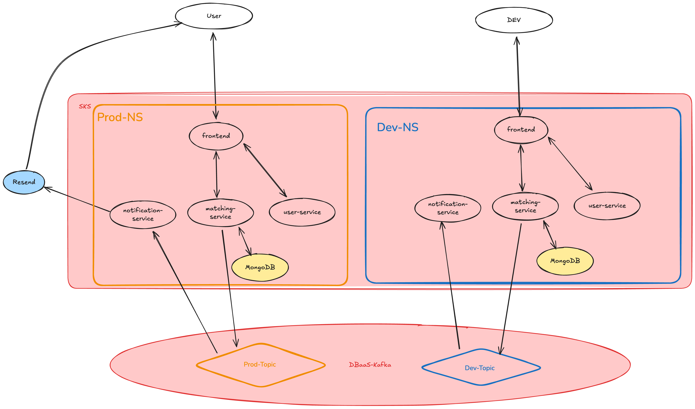

## PlayPal
This repository contains the source code for PlayPal - a progressive web application (PWA) built with a microservice architecture. The goal is to create a scalable and maintainable application by separating concerns into independent services.

This README serves as a guide for setting up the project, running the services, and understanding the infrastructure.

### 🚀 Tech Stack
- **Frontend:** React (Vite)
- **Backend Microservices:** NestJS (Node.js)
- **Database:** MongoDB (Helm on K8s)
- **Message Broker:** Kafka (Exoscale DBaaS)
- **Infrastructure:** Terraform, Kubernetes (Exoscale SKS), Helm
- **Observability:** Prometheus, Grafana, Loki, Promtail
- **CI/CD:** GitHub Actions

### 🏗 Architecture
The application follows a microservice architecture, where each service is responsible for a specific domain or functionality.



### 📂 Project Structure
The project is organized into a monorepo structure:
```
/
├── frontend/             # React PWA (Vite)
├── services/
│   ├── matching-service/ # Matching logic (NestJS + MongoDB)
│   ├── notification-service/ # Email/Push notifications (NestJS)
│   ├── user-service/     # (Planned) User profile management
│   └── ...
├── infra/                # Terraform & Helm charts for Exoscale
│   ├── charts/           # Local Helm charts (e.g. MongoDB)
│   ├── k8s/              # Kubernetes Manifests per env
│   └── main.tf           # Terraform Infrastructure definition
├── tests/                # Integration & Load tests (k6)
├── .github/workflows/    # CI/CD Pipelines
└── README.md
```

---

### ☁️ Infrastructure & Cloud
The production and staging environments are hosted on **Exoscale** using SKS (Scalable Kubernetes Service), fully managed via **Terraform**.

#### Environments
- **Production (`playpal`)**: The stable live environment.
  - URL: `https://playpal.lzainzinger.com`
- **Development (`playpal-dev`)**: The integration environment for testing new features.
  - URL: `https://dev-playpal.lzainzinger.com`

#### Central Services
The cluster runs several shared platform services:
- **Ingress NGINX**: Central entry point for all HTTP traffic.
- **ExternalDNS**: Automatically syncs Kubernetes Ingress rules to **Cloudflare** DNS records.
- **Cert-Manager**: (Planned) Automated TLS certificate management.

#### 🔭 Observability
A comprehensive monitoring stack is deployed in the `monitoring` namespace:
- **Prometheus**: Collects metrics from services and infrastructure.
- **Loki**: Aggregates logs from all pods via Promtail sidecars.
- **Grafana**: Visualizes metrics and logs.
  - URL: `https://grafana-playpal.lzainzinger.com`

---

### 🔄 CI/CD Pipeline
Deployment is automated via GitHub Actions (`pipeline.yml`).

1. **Build & Unit Test**: Code is built, linted, and unit-tested. Docker images are pushed to GHCR.
2. **Deploy to Dev**: The new images are deployed to the `playpal-dev` namespace using Helm.
3. **Integration Test**: A **k6** load/integration test suite runs against the Dev environment to verify stability.
4. **Manual Approval**: The pipeline pauses and requests manual approval from maintainers.
5. **Deploy to Prod**: Upon approval, the artifacts are promoted to the `playpal` production namespace.

---

### 💻 Local Development Setup

This guide assumes you want to run the application code locally (Node.js) while running infrastructure dependencies (MongoDB) either via Docker (recommended) or locally installed.

#### 1. Prerequisites
- **Node.js** (v18 or later)
- **pnpm** (Install via `npm install -g pnpm`)
- **Docker Desktop** (Recommended for running databases)
- **MongoDB** (If not using Docker)

#### 2. Install Dependencies
Run this for **each** component you intend to work on:

**Frontend:**
```bash
cd frontend
pnpm install
cd ..
```

**Matching Service:**
```bash
cd services/matching-service
pnpm install
cd ../..
```

**Notification Service:**
```bash
cd services/notification-service
pnpm install
cd ../..
```

#### 3. Running Infrastructure (Database)

**Option A: Using Docker (Recommended)**
Run MongoDB in a container:
```bash
# Run MongoDB
docker run -d -p 27017:27017 --name playpal-mongo mongo:6.0
```

**Option B: Locally Installed**
If you have MongoDB installed directly on your machine (e.g., via Homebrew on macOS):
```bash
brew services start mongodb-community
# OR run manually
 mongod --config /usr/local/etc/mongod.conf
```

**Kafka (Optional)**
While the infrastructure supports Kafka, local development often mocks this or uses a local container.
```bash
# Run Redpanda (Kafka compatible, lighter for dev)
docker run -d --name redpanda -p 9092:9092 -p 9644:9644 redpandadata/redpanda:latest redpanda start --mode dev-container
```

#### 4. Running Services

Open separate terminal tabs for each service.

**Frontend (Port 3000)**
```bash
cd frontend
pnpm dev
# Access at http://localhost:3000
```

**Matching Service (Port 3005)**
Requires MongoDB running.
```bash
cd services/matching-service
# Set Environment Variables (or use a .env file)
export MONGO_URI="mongodb://localhost:27017/playpal"
pnpm start:dev
```

**Notification Service (Port 3006)**
```bash
cd services/notification-service
pnpm start:dev
```

---

### 🧪 Testing Endpoints

You can test the backend services using `curl`, Postman, or Insomnia.

#### Matching Service (http://localhost:3005)

**Create a Match Request:**
```bash
curl -X POST http://localhost:3005/matching \
  -H "Content-Type: application/json" \
  -d '{
    "userId": "user123",
    "location": "Vienna",
    "sport": "Tennis",
    "skillLevel": "Intermediate",
    "availableTimes": ["2025-12-05T18:00:00Z"]
  }'
```

**Get All Requests:**
```bash
curl http://localhost:3005/matching/requests
```

**Trigger Batch Matching:**
```bash
curl -X POST http://localhost:3005/matching/run-batch
```

#### Notification Service (http://localhost:3006)

**Send Test Email:**
```bash
curl -X POST http://localhost:3006/notification/send-email \
  -H "Content-Type: application/json" \
  -d '{
    "to": "test@example.com",
    "subject": "Hello from PlayPal",
    "html": "<p>This is a test notification.</p>"
  }'
```

---

### 🛠 Development Guidelines
* **Trunk-Based Development:** Short-lived branches, frequent integrations.
* **Tests:** Write meaningful unit/integration tests. Do not chase coverage for the sake of it.
* **Formatting:** Ensure `prettier` and `eslint` pass before pushing.
* **Commits:** Follow conventional commits: `<type>: <summary> (#<issue>)`.
  * `feat: add matching logic (#12)`
  * `fix: correct mongodb connection string (#15)`

### 🤝 Contributing
1. Fork the repository.
2. Create a branch: `git checkout -b feature/my-feature`.
3. Commit changes.
4. Push to branch.
5. Open a Pull Request.

### 📄 License
MIT License